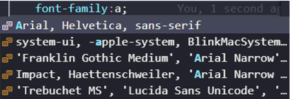
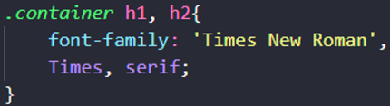

# Safe-Combination (Combinações Seguras de Fontes) 

## Alguns Exemplos
<strong>FONTE SEM SERIFA</strong> 
Arial (sans-serif) 
Verdana (sans-serif) 
Tahoma (sans-serif) 
Trebuchet MS (sans-serif) 

 

Site Oficial da W3shools Sobre combinações de fontes. Site Oficial da W3SCHOOLS - Site sobre as combinações seguras de fontes (Safe Font)
https://www.w3schools.com/cssref/css_websafe_fonts.php O ideal é sempre terminar a combinação de fonte com o nome de uma fonte genérica.  

### MUDANDO A FAMÍLIA DA FONTE

Usamos a ***propriedade*** **font-family:** e o nome da fonte ou conjunto de fonte;

Usamos a ***propriedade*** **font-family:** no **seletor** de **body**, que é do **corpo** da **página web**, com isso a fonte é aplicada para o **site** todo. 

### USANDO MÚLTIPLAS FONTES ALTERNATIVAS

Para usar **múltiplas fonte** é muito simples, depois de adicionar a **propriedade** **font-family:** no **seletor de body**, coloca a **fonte** ou **combinações** de fontes.

**EXEMPLO**: **font-family: Arial, Helvetica, sans-serif;**  

### FONTES GENÉRICAS

Ao invés de usarmos uma fonte ou um conjunto de fontes especifica, podemos usar **parâmetros** que reúnam fontes do mesmo tipo.
EXEMPLO: **sans-serif;** **fontes sem serifa**, o navegador seleciona a melhor ou a que ele reconheça.
**serif;** **fontes serifada.**
**monospace;** **fontes monoespaçadas.**  

### VSCODE TE AJUDA COM AS COMBINAÇÕES

O **VS CODE** nos ajuda nas **combinações da fonte**, depois de digitar a **propriedade font-family:** o vscode nos mostra uma **telinha pequena** com f**ontes** e **combinações de fontes**.

E caso você não saiba qual **fonte você** quer ou não conheça alguma fonte, depois da **propriedade font-family:** basta aperta a **tecla de espaço**, que ai ele vai mostrar a lista com todas as **fontes** e **combinações** que ele conhece.  

### FAMÍLIA DE FONTE PARA TÍTULOS

***Uma boa fonte*** ou **combinação de fontes**, é a **serif** ou **serifada**, **fontes serifadas** são boas para serem usadas no **título e subtítulos**.  
